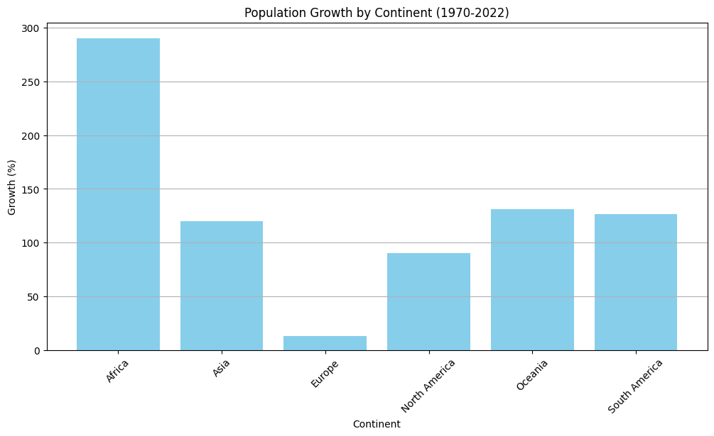

# PRODIGY_DS_01
Amazing visualizations for categorical and continuous variables

## Overview
This project focuses on analyzing and visualizing the population distribution of the continent using data from kaggle. The dataset focuses of population of various continents across the world from 1970 to 2022.

The data is obtained from [kaggle](https://www.kaggle.com/datasets/iamsouravbanerjee/world-population-dataset)

## Tables of Content
- [Data Cleaning and Preparation](#data-cleaning-and-preparation)
- [Transformation](#transformation)
- [Exploratory Data Analysis](#exploratory-data-analysis)
- [Conclusion](#conclusion)
- [Future Work](#future-work)
- [Set-Up](#set-up)
- [License](#license)

## Data Cleaning and Preparation

**Loading the data:**
```python
import kagglehub

# Download latest version
path = kagglehub.dataset_download("iamsouravbanerjee/world-population-dataset")

print("Path to dataset files:", path)
```

The dataset was cleaned and prepared for analysis by following these steps:

1. **Handling Missing Values**: Any missing or null values in the population data were addressed, either by imputation or removal, depending on the context.
2. **Data Type Conversion**: Ensured that all population figures were in numeric format for accurate analysis.
3. **Filtering Relevant Years**: Focused on the years 1970 to 2022, as per the project requirements.
4. **Reshaping the Data**: Transformed the dataset into a long format suitable for time series analysis.

<div>

<table border="1" class="dataframe">
  <thead>
    <tr style="text-align: right;">
      <th></th>
      <th>Continent</th>
      <th>Year</th>
      <th>Population</th>
    </tr>
  </thead>
  <tbody>
    <tr>
      <th>0</th>
      <td>Africa</td>
      <td>2022</td>
      <td>1426730932</td>
    </tr>
    <tr>
      <th>1</th>
      <td>Asia</td>
      <td>2022</td>
      <td>4721383274</td>
    </tr>
    <tr>
      <th>2</th>
      <td>Europe</td>
      <td>2022</td>
      <td>743147538</td>
    </tr>
    <tr>
      <th>3</th>
      <td>North America</td>
      <td>2022</td>
      <td>600296136</td>
    </tr>
    <tr>
      <th>4</th>
      <td>Oceania</td>
      <td>2022</td>
      <td>45038554</td>
    </tr>
  </tbody>
</table>
</div>

## Transformation

The dataset was transformed to facilitate better analysis and visualization. The key steps included:

From the data, we will calculate the population growth and CAGR (Compound Annual Growth Rate) for each continent over the decades.
- CAGR (Compound Annual Growth Rate) is calculated using the formula: $\frac{Ending Value}{Beginning Value}\times\frac{1}{Number of Years}-1$
- CAGR is the average annual growth rate of an investment over a specified time period longer than one year.

<div>

<table border="1" class="dataframe">
  <thead>
    <tr style="text-align: right;">
      <th>Year</th>
      <th>Continent</th>
      <th>Growth_1970_2022_%</th>
      <th>CAGR_1970_2022_%</th>
    </tr>
  </thead>
  <tbody>
    <tr>
      <th>0</th>
      <td>Africa</td>
      <td>290.409905</td>
      <td>2.653887</td>
    </tr>
    <tr>
      <th>1</th>
      <td>Asia</td>
      <td>120.120725</td>
      <td>1.528889</td>
    </tr>
    <tr>
      <th>2</th>
      <td>Europe</td>
      <td>13.297813</td>
      <td>0.240384</td>
    </tr>
    <tr>
      <th>3</th>
      <td>North America</td>
      <td>90.307634</td>
      <td>1.245134</td>
    </tr>
    <tr>
      <th>4</th>
      <td>Oceania</td>
      <td>131.200871</td>
      <td>1.624822</td>
    </tr>
    <tr>
      <th>5</th>
      <td>South America</td>
      <td>126.391835</td>
      <td>1.583751</td>
    </tr>
  </tbody>
</table>
</div>

## Exploratory Data Analysis

Some key insights from the analysis include:

**From 1970:**
- Africa: Population exploded by +290% (fastest growth), CAGR ≈ 2.65% per year.
- Asia: +120% growth, CAGR ≈ 1.53%. Still the global giant in absolute numbers.
- Europe: Barely moved, only +13% growth, CAGR ≈ 0.24%. Basically flat.
- North America: +90% growth, CAGR ≈ 1.25%. Steady but modest.
- Oceania: +131% growth, CAGR ≈ 1.62%. Small base, but healthy growth.
- South America: +126% growth, CAGR ≈ 1.58%. Middle of the pack.


1) **Population Trends (1970–2022)**
- Africa and Asia surge, Europe flatlines, North America and South America grow steadily, Oceania rises slowly.
- I used logarithmic scaling for better visualization of growth rates.


2) **Share of World Population**
- Asia dominates the world’s share across all years.
- Africa’s slice grows significantly, hinting at its demographic future.
- Europe’s share steadily shrinks.


3) **Projections (CAGR-based)**
- By 2030: Africa keeps accelerating, Europe stagnates, Asia still massive.
- By 2050: Africa becomes the key driver of global population growth, potentially overtaking Asia later in the century.


## Conclusion

The analysis of global population trends from 1970 to 2022 reveals significant disparities between continents. Africa's rapid growth contrasts sharply with Europe's stagnation, while Asia remains a dominant force. The projections for 2030 and 2050 suggest that Africa will play an increasingly pivotal role in global demographics, potentially reshaping the world's population landscape.

## Future Work

- Explore additional demographic factors influencing population trends.
- Incorporate more recent data for updated analysis.
- Investigate the impact of migration on population dynamics.

## Set-Up

1. **Clone the repository**
   ```bash
   git clone <https://github.com/Campeon254/PRODIGY_DS_01.git>
   cd <PRODIGY_DS_01>
   ```

2. **Install dependencies**
   ```bash
   pip install -r requirements.txt
   ```

## License

This project is licensed under the MIT License - see the [LICENSE](LICENSE) file for details.
